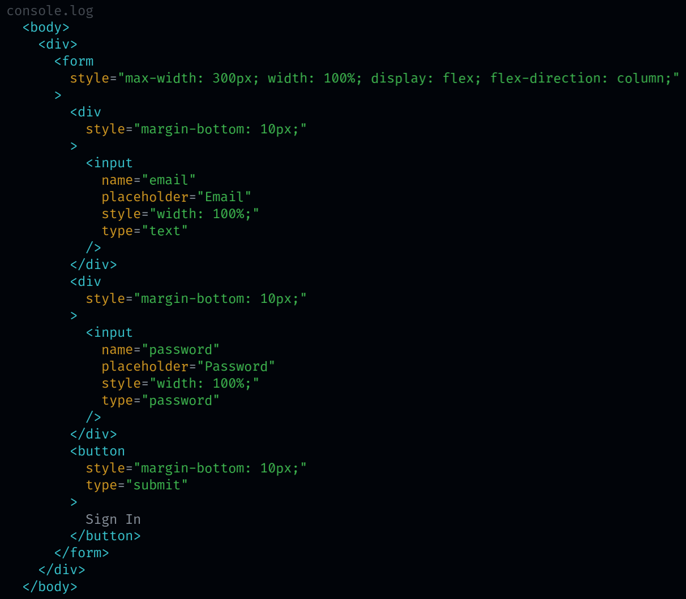

# Pruebas en React

Para ir a alguna parte de la guía de pruebas, puedes usar los siguientes enlaces:

- [Requerimientos](#requerimientos)
- [Instalación con `create-react-app`](#instalación-con-create-react-app)
- [Pruebas a componentes](#pruebas-a-componentes)
- [Pruebas a componentes con llamadas a API](#pruebas-a-componentes-con-llamadas-a-api)
- [Pruebas a hooks](#pruebas-a-hooks)
- [Recomendaciones](#recomendaciones)
- [Referencias](#referencias)

## Requerimientos

Antes de hacer pruebas con React, debes de tener instaladas las siguientes dependencias:

- [@testing-library/react](https://testing-library.com/docs/react-testing-library/intro)
- [@testing-library/jest-dom](https://testing-library.com/docs/ecosystem-jest-dom)
- [@testing-library/user-event](https://testing-library.com/docs/user-event/intro)
- [msw](https://mswjs.io/docs/getting-started/install)

## Instalación con `create-react-app`

Si usaste `create-react-app` no requieres ninguna configuración adicional.

Escribe el siguiente comando en la consola para instalar las dependencias faltantes:

```bash
yarn add msw
```

Una vez que las dependencias se hayan instalado, podemos empezar a hacer pruebas.

Escribe el siguiente comando en la consola:

```bash
yarn test
```

Esto ejecutará las pruebas en modo `watch`, es decir, se ejecutarán cada vez que se haga un cambio en el código.

Si solo quieres que se ejecute una prueba, escribes el comando anterior y pones el nombre de la prueba que quieres ejecutar, por ejemplo:

```bash
yarn test SignInForm
```

## Pruebas a componentes

**Ejemplos:**

- [SignInForm](./src/components/SignInForm.test.tsx)

**Pasos:**

1. Escribe el siguiente comando en la consola:

    ```bash
    yarn test
    ```

    Esto ejecutará las pruebas en modo `watch`, es decir, se ejecutarán cada vez que se haga un cambio en el código.

2. Establecer los criterios de aceptación, es decir, lo que debe pasar para que la prueba tenga éxito.

    **Ejemplo:**

    ```txt
    When an invalid email is entered and the form is submitted:
      It should render an error message.
      It should not call onSubmit.
    ```

3. Crear un archivo de prueba llamado `ComponentName.test.tsx` y guardarlo en el mismo nivel que el componente (Esto depende de la estructura de tu proyecto).

    **Ejemplo:**

    

4. Escribir el código de las pruebas, es decir, el código que se ejecutará para verificar que el componente cumpla con los criterios de aceptación.

    **Ejemplo:**

    ```tsx
    import { SignInForm } from './SignInForm';
    import { fireEvent, render, screen } from '@testing-library/react';

    describe('When an invalid email is entered and form is submitted', () => {
      it('should render an error message', async () => {
        render(<SignInForm onSubmit={jest.fn()} />);

        fireEvent.change(
          screen.getByPlaceholderText('Email'),
          { target: { value: 'invalid' } }
        );

        fireEvent.click(
          screen.getByRole('button', { name: 'Sign In' })
        );

        expect(screen.getByText('Email is not valid.')).toBeInTheDocument();
      });

      it('should not call onSubmit', async () => {
        const onSubmit = jest.fn();
        render(<SignInForm onSubmit={onSubmit} />);

        fireEvent.change(
          screen.getByPlaceholderText('Email'),
          { target: { value: 'invalid' } }
        );

        fireEvent.click(
          screen.getByRole('button', { name: 'Sign In' })
        );

        expect(onSubmit).not.toHaveBeenCalled();
      });
    });
    ```

5. Implementar las minimas funcionalidades requeridas del componente hasta que todas las pruebas sean exitosas.

    **Ejemplo de pruebas exitosas:**

    

6. Ahora que las pruebas son exitosas, podemos refactorizar el código del componente, por ejemplo, mover partes del componente a otros componentes, mejorar la calidad del código, etc.

    > **Es importante que hasta este punto se realice esta refactorización, ya que ahora tenemos pruebas que nos aseguran que el componente seguira cumpliendo con los criterios de aceptación.**

## Pruebas a componentes con llamadas a API

En estas pruebas usamos [MSW (Mock Service Worker)](https://mswjs.io/docs/getting-started/install) el cual nos permite interceptar las llamadas a API (con fetch, axios, etc.) y responder con una respuesta falsa.

**Ejemplos:**

- [GitHubRepos](./src/routes/GitHubRepos.test.tsx)

**Pasos:**

1. Seguir los pasos 1-3 de [pruebas a componentes](#pruebas-a-componentes).

2. Configurar el servicio de pruebas con [MSW](https://mswjs.io/docs/getting-started/install) (Esta configuración puede hacerse en un archivo aparte).

    **Ejemplo:**

    ```tsx
    import { rest } from 'msw';
    import { setupServer } from 'msw/node';

    export const server = setupServer(
      rest.get('https://api.github.com/search/repositories', (req, res, ctx) => {
        return res(
          ctx.json({
            total_count: 1,
            items: [
              {
                id: 1,
                name: 'test',
                description: 'test',
                stargazers_count: 12,
                forks_count: 10,
                owner: {
                  login: 'test'
                }
              },
            ],
          })
        );
      })
    );
    ```

3. Para que el servicio de pruebas funcione, debemos importarlo en el archivo de pruebas y iniciarlo antes de todas las pruebas.

    **Ejemplo:**

    ```tsx
    import { server } from '../mocks/GitHubRepos';

    beforeAll(() => server.listen());
    afterEach(() => server.resetHandlers());
    afterAll(() => server.close());
    ```

4. Seguir los pasos 4-6 de [pruebas a componentes](#pruebas-a-componentes).

## Pruebas a hooks

Aqui se prueba la lógica interna de un hook.

Se realizan siguiendo los mismos pasos de [pruebas a componentes](#pruebas-a-componentes).

**Ejemplos:**

- [useCounter](./src/hooks/useCounter.test.ts)

## Recomendaciones

- Usar `screen.debug()` para darte una idea de como se renderiza el componente.

  **Ejemplo:**

  ```tsx
  it('should render a form with a email input', () => {
    expect(screen.getByPlaceholderText('Email')).toBeInTheDocument();

    screen.debug();
  });
  ```

  Podremos ver el resultado de `screen.debug()` en la consola:

  

## Referencias

### Jest

- [describe](https://jestjs.io/docs/api#describename-fn)
- [test](https://jestjs.io/docs/api#testname-fn-timeout)
- [jest.fn()](https://jestjs.io/docs/mock-function-api#jestfnimplementation)
- [expect](https://jestjs.io/docs/expect#expectvalue)
  - [.toHaveBeenCalled()](https://jestjs.io/docs/expect#tohavebeencalled)
  - [.toHaveBeenCalledWith()](https://jestjs.io/docs/expect#tohavebeencalledwitharg1-arg2-)

### React Testing Library

- [Cheatsheet](https://testing-library.com/docs/react-testing-library/cheatsheet/#queries): Una pequeña guía de todas las funciones de React Testing Library.

### MSW (Mock Service Worker)

- [Configuración con Create React App](https://mswjs.io/docs/getting-started/integrate/node#using-create-react-app)
- [setupServer()](https://mswjs.io/docs/api/setup-server)
