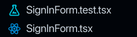
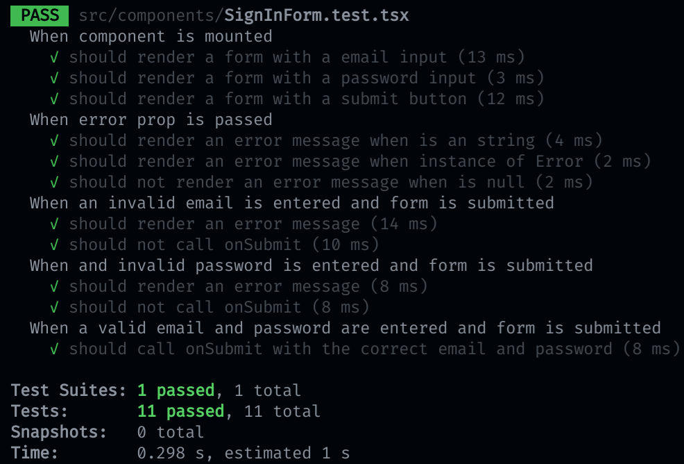

# React pruebas unitarias

## Requerimientos

Antes de hacer pruebas con React, debes de tener instaladas las siguientes dependencias:

- [@testing-library/react](https://testing-library.com/docs/react-testing-library/intro)
- [@testing-library/jest-dom](https://testing-library.com/docs/ecosystem-jest-dom)
- [@testing-library/user-event](https://testing-library.com/docs/user-event/intro)
- [msw](https://mswjs.io/docs/getting-started/install)

## Instalacion con `create-react-app`

Si usaste `create-react-app` no requieres ninguna configuración adicional.

Escribe el siguiente comando en la consola para instalar las dependencias faltantes:

```bash
yarn add msw
```

Una vez que las dependencias se hayan instalado, podemos empezar a hacer pruebas.

Escribe el siguiente comando en la consola:

```bash
yarn test
```

Esto ejecutará las pruebas en modo `watch`, es decir, se ejecutarán cada vez que se haga un cambio en el código.

## Pruebas a componentes

Ejemplos:

- [SignInForm](./src/components/SignInForm.test.tsx)

Pasos para prueba a un componente:

1. Definir criterios de aceptación, es decir, lo que debe de pasar para que la prueba se cumpla. Por ejemplo:

```txt
When an invalid email is entered and the form is submitted:
  It should render an error message.
  It should not call onSubmit.
```

2. Crear archivo de prueba, este archivo normalmente se llama `ComponentName.test.tsx` y se guarda al mismo nivel que el componente (Esto depende de la estructura de tu proyecto). Por ejemplo:



3. Escribir el código de prueba, es decir, el código que se ejecutará para verificar que el componente cumpla con los criterios de aceptación. Por ejemplo:

```tsx
import { SignInForm } from './SignInForm';
import { fireEvent, render, screen } from '@testing-library/react';

describe('When an invalid email is entered and form is submitted', () => {
  it('should render an error message', async () => {
    render(<SignInForm onSubmit={jest.fn()} />);

    fireEvent.change(screen.getByPlaceholderText('Email'), { target: { value: 'invalid' } });
    fireEvent.click(screen.getByRole('button', { name: 'Sign In' }));

    expect(screen.getByText('Email is not valid.')).toBeInTheDocument();
  });

  it('should not call onSubmit', async () => {
    const onSubmit = jest.fn();
    render(<SignInForm onSubmit={onSubmit} />);

    fireEvent.change(screen.getByPlaceholderText('Email'), { target: { value: 'invalid' } });
    fireEvent.click(screen.getByRole('button', { name: 'Sign In' }));

    expect(onSubmit).not.toHaveBeenCalled();
  });
});
```

5. Ejecutar la prueba, escribiendo `yarn test` en la consola. Lo cual iniciará la ejecución de las pruebas en modo `watch`.

6. Implementar los minimos requerimientos del componente para lograr que las pruebas sean exitosas. Cuando todas las pruebas pasan deberia de verse de la siguiente forma:



7. Ahora que las pruebas son exitosas, podemos refactorizar el código del componente, por ejemplo, mover partes del componente a otros componentes, mejorar la calidad del código, etc.

> **Es importante que en este punto se realice esa refactorización, ya que ahora tenemos pruebas que nos aseguran que el componente seguira cumpliendo con los criterios de aceptación.**

## Pruebas a componentes con llamadas a API

En estas pruebas usamos [MSW (Mock Service Worker)](https://mswjs.io/docs/getting-started/install) para simular
las llamadas a API que se realizan usando fetch, axios, etc.

Ejemplos:

- [GitHubRepos](./src/routes/GitHubRepos.test.tsx)

Pasos:

1. Seguir los pasos 1-2 de [pruebas a componentes](#pruebas-a-componentes).

2. Crear servidor de pruebas que simule las llamadas a API usando [MSW](https://mswjs.io/docs/getting-started/install). Por ejemplo:

```tsx
import { rest } from 'msw';
import { setupServer } from 'msw/node';

const server = setupServer(
  rest.get('https://api.github.com/search/repositories', (req, res, ctx) => {
    return res(
      ctx.json({
        total_count: 1,
        items: [
          {
            id: 1,
            name: 'test',
            description: 'test',
            stargazers_count: 12,
            forks_count: 10,
            owner: {
              login: 'test'
            }
          },
        ],
      })
    );
  })
);

beforeAll(() => server.listen())

afterEach(() => server.resetHandlers())

afterAll(() => server.close())
```

3. Seguir los pasos 3-7 de [pruebas a componentes](#pruebas-a-componentes).

## Pruebas a hooks

Aqui no se prueba la interacción con el usuario, sino la lógica interna de un hook.

Se realizan siguiendo los mismos pasos que las [pruebas a componentes](#pruebas-a-componentes).

Ejemplos:

- [useCounter](./src/hooks/useCounter.test.ts)
